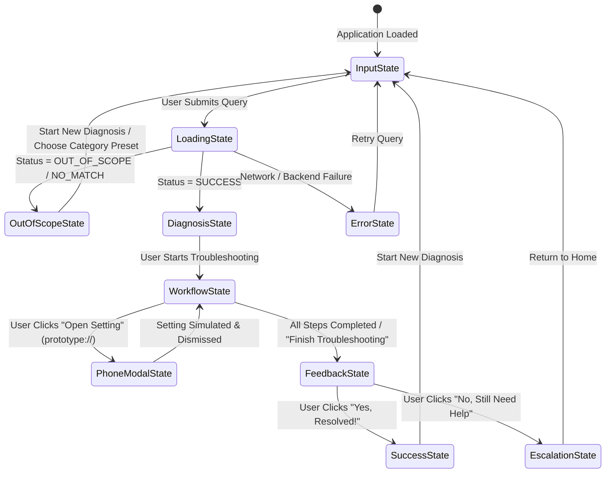

# Phase 4 — Interactive Product Prototype UI & Guided Troubleshooting Workflow

> **Project**: SmartGuide — Samsung PRISM Theme 2 Prototype: Smart Guided Troubleshooting Engine  
> **Phase**: Phase 4 — Interactive Product Prototype UI + Guided Troubleshooting Workflow  
> **Frontend Stack**: React 19, TypeScript, Vite 8, Lucide React, Custom One UI-Inspired Responsive CSS  
> **Backend Integration**: FastAPI (`POST /troubleshoot`, `GET /health`) with CORS support  
> **URI Protocol**: Prototype URI Scheme (`prototype://...`)  

---

## 1. Executive Summary

Phase 4 delivers a responsive web UI for the Smart Guided Troubleshooting Engine. The user interface translates backend query understanding, neural semantic search, hybrid BM25 retrieval, reciprocal rank fusion (RRF), and prototype deeplink resolution into an intuitive, guided mobile troubleshooting experience.

### Key Capabilities
1. **Natural Language Query Intake**: Freeform complaint input with rapid category presets (Battery, Display, Camera, Performance) and live backend health monitoring.
2. **Deterministic Stage Progression**: Visual 5-stage pipeline animation depicting query analysis, signal extraction, neural retrieval, deeplink resolution, and response generation.
3. **Diagnosis Card**: Clear primary diagnosis presentation with domain badges, confidence meters, problem summaries, and grounded retrieval reasoning.
4. **Interactive Step-by-Step Guided Workflow**: Sequenced actions with step completion tracking, collapsible details, and actionable deep link triggers.
5. **Interactive Phone Settings Simulator**: An interactive mobile device mockup that renders all 16 prototype target settings screens with toggle switches, sliders, simulated actions, and breadcrumb navigation.
6. **Resolution Feedback & Simulated Escalation**: Interactive post-troubleshooting feedback ("Did this resolve your issue?"), success celebrations, and smart escalation routing for unresolved complaints.
7. **Graceful Out-of-Scope Handling**: User-friendly redirection for unsupported complaints (smart home, account recovery, hardware repair) without dead-ends.
8. **Hackathon Technical Diagnostic Inspector**: Collapsible bottom drawer for technical judges revealing canonical rewrites, signal breakdown, hybrid retrieval candidates, RRF scores, execution latency, and raw JSON payloads.

---

## 2. Frontend Architecture & Directory Structure

```
frontend/
├── index.html                      # Entry HTML with One UI styling & responsive viewport
├── package.json                    # Dependencies (React 19, Lucide React, Vite, TS)
├── tsconfig.json                   # Strict TypeScript compiler options
├── tsconfig.app.json               # App-specific TS rules (verbatimModuleSyntax enabled)
├── vite.config.ts                  # Vite build configuration with proxy support
│
└── src/
    ├── main.tsx                    # React DOM root mounting
    ├── App.tsx                     # Master state machine & workflow orchestrator
    │
    ├── types/
    │   └── api.ts                  # TypeScript interfaces matching backend Pydantic models
    │
    ├── services/
    │   └── api.ts                  # REST API client with timeout, error handling & health checks
    │
    ├── styles/
    │   └── index.css               # Samsung One UI design system (colors, typography, modals, phone)
    │
    └── components/
        ├── Header.tsx              # Navigation bar, brand badge, backend status, debug toggle
        ├── QueryInput.tsx          # Complaint input box, category presets, disclaimer
        ├── LoadingState.tsx        # Multi-stage animated processing indicator
        ├── DiagnosisCard.tsx       # Primary diagnosis, domain badge, confidence score, reasoning
        ├── GuidedWorkflow.tsx      # Step progression checklist, deeplink triggers, step completion
        ├── SimulatedSetting.tsx    # Mobile device phone mockup supporting all 16 target screens
        ├── ResolutionFeedback.tsx  # Issue resolution confirmation, success screen, escalation options
        ├── OutOfScopeView.tsx      # Friendly boundary guidance for unsupported domains
        ├── ErrorView.tsx           # Network/server error boundary with retry mechanisms
        └── DebugPanel.tsx          # Judge/evaluator technical diagnostic inspector
```

---

## 3. State Machine & User Workflow



---

## 4. Component Breakdown & Functional Specifications

### 4.1. Header (`Header.tsx`)
- Displays the SmartGuide logo with a Theme 2 Hackathon badge.
- Live backend connection status indicator (pulsing green dot for Online, amber for Offline).
- "Technical Pipeline" toggle button to inspect backend inference telemetry.
- "New Diagnosis" button to quickly reset the state machine.

### 4.2. Query Input & Presets (`QueryInput.tsx`)
- Large search input with clear button and submit icon.
- Interactive category preset chips:
  - **Battery**: *"battery draining fast after update"*
  - **Display**: *"screen is too dim in sunlight"*
  - **Camera**: *"camera photos are blurry in low light"*
  - **Performance**: *"apps keep freezing and running slow"*
  - **Out of Scope**: *"how to connect smart fridge to wifi"*
- Prototype notice banner reinforcing that all actions and URIs operate in a development simulation environment.

### 4.3. Multi-Stage Loading Indicator (`LoadingState.tsx`)
- Animated spinning radar graphic.
- Progressive stage labels reflecting the multi-stage backend pipeline:
  1. *Analyzing natural language query & colloquial patterns...*
  2. *Extracting domain signals & canonicalizing complaint...*
  3. *Performing hybrid BM25 lexical & neural semantic search...*
  4. *Resolving prototype deeplinks & parameter sequencing...*
  5. *Formatting guided troubleshooting plan...*

### 4.4. Diagnosis Card (`DiagnosisCard.tsx`)
- Domain category pill (Battery, Display, Camera, Performance) with color-coded styling.
- Problem title and structured description.
- Visual confidence percentage bar with badge status (High / Good / Moderate).
- Grounded technical reasoning explaining why the diagnosis was retrieved.
- Call-to-action button to enter the step-by-step guided workflow.

### 4.5. Guided Workflow (`GuidedWorkflow.tsx`)
- Step-by-step numbered progress bar showing current progress (e.g., "Step 2 of 3").
- Active step card featuring:
  - Action title and clear instruction text.
  - Target settings screen destination (e.g., `Settings > Battery > Background Usage Limits`).
  - Interactive **"Open Setting (Simulated)"** button launching the phone mockup.
  - Step completion checkbox and "Next Step" / "Previous Step" navigation.
- Expandable accordion for upcoming and completed actions.

### 4.6. Phone Settings Simulator (`SimulatedSetting.tsx`)
- Renders an interactive phone mockup with status bar, dynamic title, and One UI styling.
- Implements interactive mock controls for all 16 target screens in the development dataset:
  1. `settings_battery`: Power saving toggle & battery usage graph.
  2. `settings_display`: Brightness slider & Adaptive Brightness toggle.
  3. `settings_display_refreshrate`: Smoothness modes (High 120Hz vs Standard 60Hz).
  4. `settings_apps_battery`: Deep Sleeping Apps list and app background restriction.
  5. `settings_camera_resolution`: Camera quality settings (108MP, 50MP, 12MP).
  6. `settings_camera_optimizer`: Scene Optimizer & Auto HDR toggles.
  7. `settings_camera_reset`: Camera settings reset button with confirmation.
  8. `settings_device_care`: Memory cleaning optimizer button with freed RAM animation.
  9. `settings_display_timeout`: Screen timeout radio buttons (15s, 30s, 1m, 2m, 5m, 10m).
  10. `settings_sound`: Sound profile switchers (Sound, Vibrate, Mute).
  11. `settings_notifications`: Do Not Disturb mode toggle & app notification manager.
  12. `settings_connections_wifi`: Wi-Fi toggle switch & connected network details.
  13. `settings_connections_bluetooth`: Bluetooth toggle switch & paired devices list.
  14. `settings_storage`: Storage cleaner button with storage breakdown bar.
  15. `settings_system_update`: Check for Updates button with system up-to-date confirmation.
  16. `settings_security`: Biometrics & screen lock settings.
- Displays the raw `prototype://...` URI for technical transparency.
- "Apply & Return to Steps" button automatically marks the active step complete.

### 4.7. Resolution Feedback & Escalation (`ResolutionFeedback.tsx`)
- Post-workflow verification asking if the troubleshooting steps resolved the issue.
- **Success Mode**: Celebration screen with positive confirmation and quick option to run another diagnostic.
- **Escalation Mode**: Smart routing with simulated escalation cards:
  - *Samsung Authorized Service Center*: Simulated appointment booking.
  - *Samsung Members Diagnostics*: Hardware test suite simulation.
  - *Live Support Chat*: Simulated technical agent transfer.

### 4.8. Out-of-Scope View (`OutOfScopeView.tsx`)
- Transparent communication when a query falls outside supported domains (e.g., account recovery, home appliances).
- Displays supported capability chips that users can click to immediately test supported scenarios.

### 4.9. Hackathon Technical Pipeline Inspector (`DebugPanel.tsx`)
- Collapsible bottom drawer for hackathon judges and evaluators.
- **Signal Extraction**: Shows canonical rewrite, detected domain, action intent, and extracted entity tokens.
- **Hybrid Retrieval Breakdown**: Displays Top-K retrieval candidates with both BM25 scores, Neural cosine similarities, RRF fused scores, and target screen mappings.
- **Execution Telemetry**: Displays round-trip execution latency in milliseconds.
- **Raw JSON Payload**: Formatted JSON response viewer with one-click clipboard copy.

---

## 5. Prototype URI Compliance

All deep link navigation strictly adheres to the development prototype specification:
- Scheme: `prototype://`
- No proprietary `bixby://`, `samsungapps://`, or internal Android Intent URI schemes are fabricated.
- Deep link parameters (such as `?mode=high` or `?app=active`) are cleanly parsed and reflected in the simulated phone interface.

---

## 6. How to Run the Prototype

### Prerequisites
- Python 3.10+ (tested with Python 3.14)
- Node.js 18+ & npm (tested with Node 24.14.1 & npm 11.11.0)

### Terminal 1: Start Backend
```powershell
cd C:\samsung
$env:PYTHONPATH="."
python backend/app/main.py
```
*Backend runs at `http://localhost:8000` (`/docs` available for OpenAPI exploration).*

### Terminal 2: Start Frontend
```powershell
cd C:\samsung\frontend
npm run dev
```
*Frontend dev server runs at `http://localhost:5173`.*

### Building for Production
```powershell
cd C:\samsung\frontend
npm run build
```
*Compiles strict TypeScript and outputs production assets to `frontend/dist/`.*

---

## 7. Verification Summary

| Test / Check | Result | Details |
|---|---|---|
| **Backend Unit & Integration Tests** | **63 Passed** | All test suites (`test_data`, `test_schema`, `test_retrieval`, `test_holdout`, `test_services`) pass cleanly. |
| **Frontend TypeScript & Build** | **0 Errors** | `tsc -b && vite build` completes in < 1.0s with zero type errors. |
| **CORS Middleware** | **Verified** | `CORSMiddleware` configured on FastAPI backend for seamless local communication. |
| **Simulated Target Screens** | **16 / 16** | All 16 prototype deep link targets fully supported with interactive controls. |
| **Out-of-Scope Handling** | **Verified** | Rejection and fallback guidance for out-of-scope queries working correctly. |
| **Inspector Drawer** | **Verified** | Real-time telemetry, RRF score breakdown, and JSON inspection operational. |
