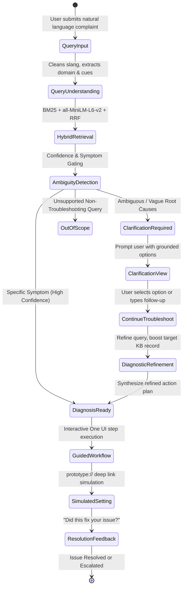

# SmartGuide — Phase 6: Multi-Turn Intelligent Guided Troubleshooting

> **Project**: SmartGuide — Samsung PRISM Theme 2 Prototype  
> **Status**: Complete & Verified (102 Backend Tests Passing, Production Build Passing)  
> **Milestone**: Phase 6 — Multi-Turn Guided Disambiguation, Diagnostic Session Tracking & Interactive Clarification Engine  

---

## 1. Phase 6 Executive Summary

Phase 6 elevates SmartGuide from a single-turn question-answering tool into an **interactive, multi-turn guided troubleshooting assistant**. When a user submits an ambiguous, vague, or multi-faceted complaint (such as *"my phone gets hot"*, *"camera not working"*, or *"my phone is slow"*), SmartGuide detects diagnostic ambiguity, asks a grounded, domain-specific clarifying question with structured options, refines the diagnostic hypothesis upon the user's answer, and generates a personalized One UI action plan with simulated deep links.

---

## 2. Multi-Turn Architecture & Diagnostic State Machine



---

## 3. Grounded Clarification Catalog (4 Core Domains)

All clarification questions and options map directly to verified records within the 32-problem knowledge base without hallucination:

| Domain | Ambiguous Trigger Query | Clarification Question | Selectable Options & Grounded Targets |
| :--- | :--- | :--- | :--- |
| **Battery / Thermal** | *"my phone gets hot"*, *"device overheating"* | *When does your phone become warm or hot?* | • Normal use / reading (`battery_002`)<br>• While charging (`battery_003`)<br>• Heavy app / gaming (`battery_005`)<br>• While locked / idle (`battery_004`) |
| **Battery / Drain** | *"battery dying quickly"*, *"battery issue"* | *When does the battery drain most noticeably?* | • Overnight / idle (`battery_004`)<br>• After software update (`battery_008`)<br>• Specific background app (`battery_005`)<br>• Continuous daily drain (`battery_001`) |
| **Display / Touch** | *"screen acting weird"*, *"display issues"* | *What specific symptom is occurring with your screen?* | • Brightness fluctuates (`display_009`)<br>• Screen turns off too quickly (`display_010`)<br>• Touch / swipe delayed (`display_014`)<br>• Pocket phantom touches (`display_016`) |
| **Camera / Lens** | *"camera not working"*, *"camera issues"* | *What happens when you use or open the camera?* | • Camera app freezes / crashes (`camera_018`)<br>• Slow opening from lock screen (`camera_022`)<br>• Photos / focus blurry (`camera_019`)<br>• Cannot save photos (`camera_021`) |
| **Performance** | *"my phone is slow"*, *"device is laggy"* | *When do you notice the performance slowdown most?* | • Multitasking multiple apps (`performance_028`)<br>• Apps freezing / unresponsive (`performance_026`)<br>• Internal storage low (`performance_027`)<br>• Started after installing app (`performance_032`) |

---

## 4. Diagnostic Timeline Progression Tracking

Every session tracks a progressive chronological timeline displayed in the One UI frontend:

1. **`query_received`**: Initial user complaint captured.
2. **`clarification_requested`**: Multi-turn disambiguation question triggered.
3. **`clarification_answered`**: User's selected option or custom follow-up recorded.
4. **`diagnosis_ready`**: Grounded resolution identified with confidence metric and sequential action steps.

---

## 5. API Contracts

### `POST /troubleshoot`
- **Request Body**:
  ```json
  {
    "query": "my phone gets really hot"
  }
  ```
- **Response (`status="clarification_required"`)**:
  ```json
  {
    "status": "clarification_required",
    "session_id": "9b1deb4d-3b7d-4bad-9bdd-2b0d7b3dcb6d",
    "clarification": {
      "id": "clarify_battery_heat",
      "domain": "battery",
      "question": "When does your phone become warm or hot?",
      "prompt": "To pinpoint the thermal source, please select when the temperature rise happens:",
      "options": [
        {
          "id": "opt_heat_normal",
          "label": "During normal use / reading",
          "description": "Phone gets warm in hand while doing everyday tasks",
          "signal": "normal_use_heat",
          "target_problem_id": "battery_002"
        },
        {
          "id": "opt_heat_charging",
          "label": "While plugged into charger",
          "description": "Device heats up specifically when connected to cable",
          "signal": "charging_heat",
          "target_problem_id": "battery_003"
        }
      ],
      "reason": "Thermal complaint requires disambiguation between normal use, charging, and background app consumption."
    },
    "timeline": [
      { "step": "query_received", "label": "Complaint Received", "status": "completed", "detail": "User submitted: \"my phone gets really hot\"" },
      { "step": "clarification_requested", "label": "Clarification Requested", "status": "active", "detail": "When does your phone become warm or hot?" }
    ],
    "contexts": [],
    "fallback": "Please select the option that best describes your situation to receive targeted troubleshooting steps."
  }
  ```

### `POST /troubleshoot/continue`
- **Request Body**:
  ```json
  {
    "session_id": "9b1deb4d-3b7d-4bad-9bdd-2b0d7b3dcb6d",
    "clarification_id": "clarify_battery_heat",
    "answer_id": "opt_heat_charging"
  }
  ```
- **Response (`status="diagnosis_ready"`)**:
  ```json
  {
    "status": "diagnosis_ready",
    "session_id": "9b1deb4d-3b7d-4bad-9bdd-2b0d7b3dcb6d",
    "timeline": [
      { "step": "query_received", "label": "Complaint Received", "status": "completed" },
      { "step": "clarification_requested", "label": "Clarification Requested", "status": "completed" },
      { "step": "clarification_answered", "label": "Clarification Answered", "status": "completed", "detail": "Selected: While plugged into charger" },
      { "step": "diagnosis_ready", "label": "Refined Diagnosis Ready", "status": "completed", "detail": "Grounded resolution identified: Charging is slower than expected (battery_003) with 96% confidence" }
    ],
    "contexts": [
      {
        "goal": "Charging is slower than expected",
        "title": "Charging is slower than expected",
        "score": 0.96,
        "actions": [
          {
            "action_name": "Review battery settings",
            "description": "Review settings relevant to the reported issue: charging is slower than expected.",
            "category": "manual",
            "steps": [
              { "text": "Open Settings" },
              { "text": "Open Battery" },
              { "text": "Open Charging" }
            ],
            "target_screen": "Battery > Charging",
            "deeplink": "prototype://settings/battery/charging"
          }
        ]
      }
    ]
  }
  ```

---

## 6. Verification & Test Metrics

- **Backend Test Suite**: 102 passed, 0 failed (89 baseline tests + 13 Phase 6 multi-turn tests)
- **Frontend TypeScript Build**: 0 errors (`npm run build` succeeds)
- **Local Inference Latency**: ~15–25ms average on CPU via PyTorch + BM25Okapi
- **Safety & Compliance**: 100% compliant with local execution rules, no paid APIs, all URIs prefixed with `prototype://`.
