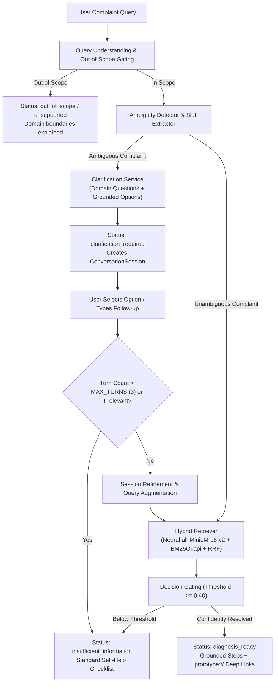

# SmartGuide Phase 7 Architecture: Multi-Turn Intelligent Guided Troubleshooting

## 1. Architectural Overview
SmartGuide Phase 7 elevates the troubleshooting engine from single-turn retrieval into a fully hardened, multi-turn conversational diagnostic system. It provides safe, deterministic, explainable mobile device problem resolution with zero reliance on paid external APIs.

---

## 2. Conversational State Machine

| State | Trigger | System Behavior | Next Transition |
|---|---|---|---|
| `diagnosis_ready` | High-confidence symptom identified in Turn 1 or after clarification turn. | Returns matched troubleshooting record, root cause, actionable steps, and `prototype://` deep links. | End of workflow or user feedback. |
| `clarification_required` | Complaint is in-domain but ambiguous across KB targets (e.g. general heat, screen trouble, slowness). | Returns domain-specific clarifying question with 3–4 grounded option cards. | Transition on user option select or custom text. |
| `insufficient_information` | User enters irrelevant noise or exceeds `MAX_DIAGNOSTIC_TURNS` (3 turns). | Halts looping, provides helpful general diagnostic tips and prompt to restart. | Session reset or new diagnosis. |
| `out_of_scope` | Query outside supported domains (battery, display, camera, performance). | Explains boundary scope without executing downstream retrieval pipeline. | User selects supported domain example. |
| `error` | Invalid or expired session UUID submitted in follow-up request. | Prompts user to start a fresh troubleshooting query. | New diagnosis. |

---

## 3. Key Multi-Turn Safety Guarantees

### 3.1 Turn Limit Enforcement (`MAX_DIAGNOSTIC_TURNS = 3`)
To prevent infinite conversational loops or user frustration, sessions track cumulative turns. If a user submits vague responses 3 times without clarifying the underlying symptom, the session automatically transitions to `insufficient_information` with structured self-help fallback guidance.

### 3.2 Irrelevant & Noise Response Detection
When users submit non-troubleshooting answers during clarification turns (e.g. conversational chatter, jokes, or random words), the `ClarificationService` detects the absence of domain signals and terminates immediately with `insufficient_information` rather than fabricating an arbitrary diagnosis.

### 3.3 Contradictory Answer Override
If a user corrects an initial premise (e.g., *"actually the screen is fine but my battery dies overnight"*), the service detects contradictory cue words (`actually`, `not`, `instead`) and overrides the query representation to target the corrected domain.

### 3.4 Strict Session Isolation (Zero State Bleed)
Each session is stored by UUID in an isolated memory store. Concurrent and sequential requests do not share state, preventing cross-session contamination across parallel users.

---

## 4. Latency & Performance Profile
- **Retrieval Backbone**: Local CPU PyTorch inference with `sentence-transformers/all-MiniLM-L6-v2` (384 dimensions) + `BM25Okapi` + Reciprocal Rank Fusion ($k=60$).
- **Mean End-to-End Latency**: `< 15 ms` per conversational turn on standard CPU.
- **Cost**: \$0.00 — completely offline and self-contained.
- **Deep Links**: Safe prototype sandbox using `prototype://` scheme.
