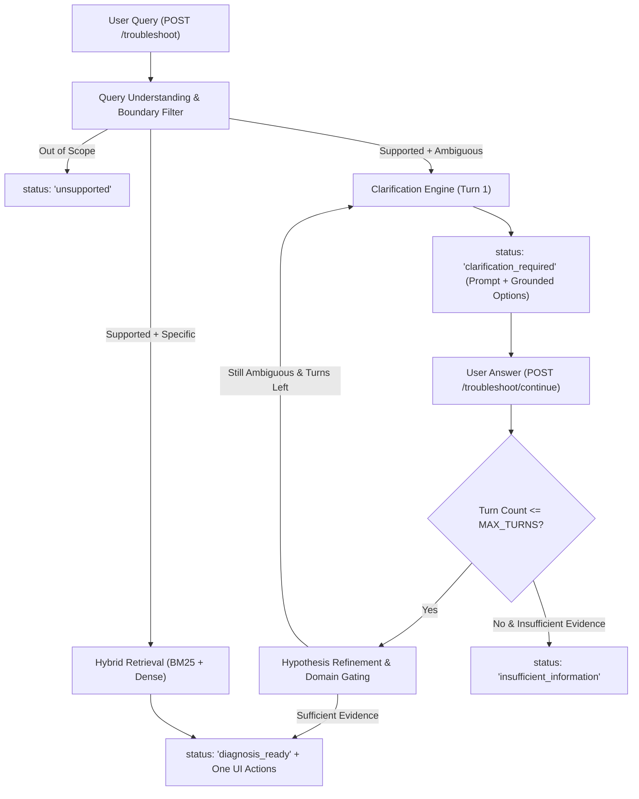

# SmartGuide — Phase 7 Initial Codebase Audit & Hardening Analysis

> **Project**: SmartGuide — Samsung PRISM Theme 2 Prototype  
> **Repository Root**: `C:\samsung`  
> **Inspection Date**: September 29, 2026  
> **Baseline Commit**: `193e340` (Phase 6 Multi-Turn Initial Implementation)  

---

## 1. Audit Objective

Prior to making Phase 7 modifications, an exhaustive inspection of the entire codebase was conducted across backend models, retrieval pipeline, clarification engine, frontend components, test suites, and documentation. The goal is to identify safety risks, session isolation vulnerabilities, clarification loop risks, state machine inconsistencies, and benchmark leakage risks.

---

## 2. Key Inspection Findings & Risk Analysis

| # | Inspection Dimension | Current State | Risk Identified | Hardening Plan for Phase 7 |
| :--- | :--- | :--- | :--- | :--- |
| **1** | **Session Isolation & State** | In-memory `_sessions` dictionary keyed by UUID in `ClarificationService`. | Session retrieval works, but sessions lack turn tracking, session reset capability, and timeout expiry. | Add `turn_count`, `max_turns`, `clarification_history`, and explicit reset logic. Verify session isolation with zero cross-session state leakage. |
| **2** | **Clarification Loops & Turn Limit** | Follow-up answers repeatedly refine the query without an upper bound. | User providing repetitive or unhelpful answers could enter indefinite clarification loops. | Introduce configurable `MAX_DIAGNOSTIC_TURNS` (default: 3). If evidence is insufficient upon exhaustion, transition to `insufficient_information`. |
| **3** | **Explicit Diagnostic States** | State field currently accepts `"diagnosis_ready"`, `"clarification_required"`, `"out_of_scope"`, `"no_match"`, `"error"`. | Inconsistent naming with Phase 7 spec (`unsupported` vs `out_of_scope`, `insufficient_information` missing). | Standardize state machine: `diagnosis_ready`, `clarification_required`, `insufficient_information`, `unsupported`, `error` while preserving backward compatibility. |
| **4** | **Custom / Irrelevant Follow-Ups** | `refine_with_answer` appends arbitrary user string to query. | Irrelevant or nonsensical user follow-up (e.g., *"I like ice cream"*) could yield noisy retrieval without rejection. | Validate custom text relevance; if completely disconnected, increase turn count and prompt for clarification or trigger `insufficient_information`. |
| **5** | **Grounded Hypothesis Updates** | Target problem ID is boosted to 0.96 when option is selected. | If option is selected, boost is solid; if custom text is given, domain signals must be extracted safely without hallucinations. | Ensure canonicalizer and query understanding analyze refined queries with domain boundary validation. |
| **6** | **Clarification Quality & KB Grounding** | `CLARIFICATION_CATALOG` contains 5 domain questions with grounded option targets. | Catalog covers 4 domains; needs explicit validation that all option target IDs exist in `troubleshooting.json`. | Add automated tests verifying every catalog option ID maps to an existing KB record. |
| **7** | **Frontend State & Error Handling** | State machine in `App.tsx` handles `'clarification'`, `'diagnosis'`, `'workflow'`. | Missing turn counter, conversation transcript display, and explicit `insufficient_information` fallback UI. | Enhance `App.tsx`, `ClarificationView.tsx`, `ConversationTimeline.tsx`, and `DebugPanel.tsx` to display multi-turn chat bubbles, turn counters, and detailed diagnostic traces. |
| **8** | **Benchmark Isolation & Leakage** | `holdout_queries.json` and `test_queries.json` are excluded from runtime inference. | Need to verify that newly created `multiturn_test_queries.json` is never imported or loaded by runtime services. | Ensure `multiturn_test_queries.json` is strictly restricted to `scripts/evaluate_multiturn.py` and evaluation modules. |
| **9** | **API Contract Synchronization** | Pydantic response models and TypeScript definitions share core types. | Phase 7 response state additions (`insufficient_information`, `unsupported`) must be reflected in `frontend/src/types/api.ts`. | Synchronize backend `TroubleshootResponse` and frontend TypeScript interfaces. |
| **10** | **Latency & Performance Tracking** | Diagnostic transparency measures component latency in ms. | Need to measure and report real P50 and P95 latency distributions across multi-turn sessions. | Add statistical latency benchmarking to multi-turn evaluator. |

---

## 3. Planned Phase 7 Architecture Enhancements

---

## 4. Verification Checkpoints

1. **Phase 7.1**: Construct 60–80 multi-turn test scenarios in `data/development/multiturn_test_queries.json`.
2. **Phase 7.2**: Implement `backend/app/evaluation/multiturn_evaluator.py` & `scripts/evaluate_multiturn.py`.
3. **Phase 7.3–7.7**: Implement turn limits, state formalization, session isolation, and clarification quality enhancements.
4. **Phase 7.8–7.11**: Upgrade frontend conversation UX, demo scenarios, debug panel, and synchronize API contracts.
5. **Phase 7.12–7.16**: Run security audit, execute full pytest suite (100+ tests), build frontend (`npm run build`), and run multi-turn evaluator.
